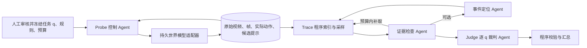

# PTJ — Probe–Trace–Judge

PTJ 是对交互式视频世界模型做**可追溯物理现象判断**的独立 Python 子模块。Probe 在同一模型会话中主动制造观察机会；Trace 从实际动作、原始帧及候选事件中取证；Judge 对预先冻结的原子问题 `q` 逐题判断。任务的物理分类沿用 ActPhyTrace 的 `P → p → C → q`，执行协议 `T` 与评分维度 `S` 是 `q` 的属性。

**实现状态（2026-09-29）：** 通用编排、数据契约、进程式 Agent 接口、离线视频登记、四态评分和测试已实现。仓库没有指定或接入任何真实世界模型/VLM，也没有人审正例、真实实验分数或模型效果结论。`tests/` 的合成帧只验证软件路径，不是物理评测数据。

## 架构



控制 Agent 只能看到操作目标、最新原图、实际动作历史、阶段和预算。控制输出的事件提示只是候选；执行了向前动作不能证明碰撞。Trace 从原始全景帧取窗口，记录原始帧 ID 与视频时间戳，并对缺失证据做有界补查。Judge 只能引用已选原图；`pass` / `violation` 必须有可见触发和充分证据，`untriggered` 还要求全时段覆盖。证据不足返回 `undetermined`。预先配置的 `applicable: false` 才产生 `N/A`。

各角色可使用不同 VLM。它们通过各自独立的进程命令接入；具体模型、prompt 和图像编码由接入进程负责。同一个 VLM 的多次调用不构成独立证据。视频解码或原图导出、动作合法性、帧索引、补查次数和评分由程序负责。

## 安装与验证

需要 Python 3.10+；核心库只有标准库依赖。

```powershell
python -m pip install -e .
python -m unittest discover -s tests -v
python -m ptj validate-task examples/c1_if016_qualification_draft.json
```

### 1. 准备任务

参见 [`examples/c1_if016_qualification_draft.json`](examples/c1_if016_qualification_draft.json)。每个 `q` 明确 P/p/C、S、前提、所需证据、通过与违反判据，以及 `required` 和 `applicable`。任务在运行前确定；`config.json` 保存完整任务和 SHA-256。资格或先导任务的数值只用于开发分析，不能混入正式评测。

### 2A. 闭环 Probe

在 Python 中实现 `ptj.probe.WorldAdapter` 的 `reset(run_dir)`、`step(actions, ticks)`、`finalize(video_path)`，并提供已验证的 `allowed_actions`。每次返回未修改的完整画面路径与真实视频时间；`step` 还返回**实际执行**的动作。所有帧必须位于运行目录内，`finalize` 写出完整 `video.mp4`。`step([], ticks)` 是已验证的中性操作，不能假设所有模型都支持。

控制器可实现 `decide(view)`，或使用 `ptj.agents.CommandController(CommandAgent(command, run_dir))`。调用：

```python
from ptj.probe import run_probe

run_probe(task, controller, world_adapter, run_dir,
          metadata={"model_id": "实际模型名", "model_version": "实际版本", "seed": 0})
```

`HOLD` 必须指定适配器已验证的动作；`WAIT` 发送空动作；`FINISH` 结束。每步记录请求动作、实际动作、原图、时间和提示。控制侧看不到 Judge 输出。若适配器或控制器失败，运行保留已有记录并调用 `finalize`；`probe_status.json` 标记失败，不得把该运行悄悄当成功样本。

### 2B. 登记已有视频

不做主动控制时，用 MP4 和从**同一原始视频**导出的全帧图像登记离线运行。清单示例：

```json
{"frames": [
  {"source_image": "frames/000.png", "video_time_s": 0.0, "phase": "baseline"},
  {"source_image": "frames/001.png", "video_time_s": 0.04, "phase": "attempt"}
]}
```

帧路径相对清单文件，时间戳须对应原视频。PTJ 复制原图和 MP4、编排帧 ID；不会伪造动作日志。视频解码与时间戳核验由外部导出工具/适配器负责。

```powershell
python -m ptj ingest task.json input.mp4 frame_manifest.json runs/model/case/seed
```

### 3. Trace 与 Judge

提供 Agent 命令配置，例如：

```json
{
  "timeout_s": 120,
  "checker_command": ["python", "my_checker.py"],
  "judge_command": ["python", "my_judge.py"],
  "locator_command": ["python", "my_locator.py"]
}
```

`locator_command` 可省略。每个进程从 stdin 读取一次 JSON、向 stdout 写一次 JSON；输入包含角色、当前 `q`、原图绝对路径、帧 ID/时间戳和必要的实际动作。**接入程序必须把图像内容送入其 VLM；只读取路径、阶段或文字提示不能算视觉判断。** 具体协议在 [`docs/agent_protocol.md`](docs/agent_protocol.md)。

```powershell
python -m ptj evaluate task.json runs/model/case/seed --agents agents.json
```

输出 `evidence.json`、`scores.json`。汇总包括 `pass/(pass+violation)`、可评估分母、四态数量、决定性覆盖率、按 P 和 S 的分类统计及必要问题的任务结果。分母为零时 `pass_rate` 为 `null`。`formal` 之外的运行显示 `official_score_eligible: false`。S3 历史问题要提交初次事件与后续交互；S4 需要真实匹配运行，本版尚未实现成对运行判定，任务验证会明确拒绝 S4 问题。

## 目录与数据

| 路径 | 内容 |
|---|---|
| `ptj/contracts.py` | 冻结任务、数据读写和帧校验 |
| `ptj/probe.py` | 控制器与持久世界模型适配器协议、闭环记录 |
| `ptj/trace.py` | 程序取窗、证据检查与有界补查 |
| `ptj/judge.py` | 四态判定校验和确定性评分 |
| `ptj/agents.py` | 控制、定位、证据检查、裁判的独立进程桥接 |
| `ptj/ingest.py` | 已有 MP4 与原始全帧登记 |
| `tests/` | 合成软件用例：正常、违规、证据不足、未触发与约束错误 |

真实运行建议放在 `runs/<model>/<case>/<seed>/`，保留 `config.json`、`video.mp4`、`actions.jsonl`、`frames.jsonl`、`event_hints.jsonl`、`evidence.json`、`scores.json`。`runs/` 被 Git 忽略，原始实验需要另行妥善归档。局部裁剪可供 VLM 辅助观察，但必须保留完整原帧和映射；本版不生成裁剪。

## 后续接入门槛

选择世界模型后，先独立验证控制主体、动作语义、中性操作、会话持续和时间单位，再实现其 `WorldAdapter`。选择 VLM 后，分别在人工标注的小集合上检查控制动作合法率、事件定位召回、证据缺口识别与逐题裁判一致性。C1 IF016 示例对低栏攀越保持开放，只把穿过可见石材本体视为明确违反；正式计分前仍需人工核实正例和准入条件。
